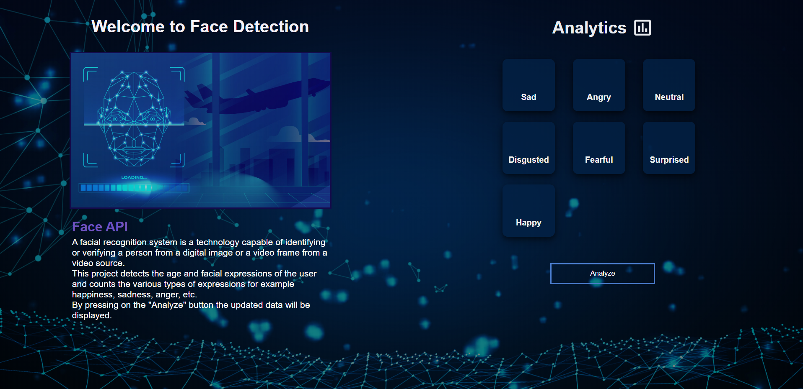

# AI Expression Detection

JavaScript web application that detects facial expressions using [face-api.js](https://github.com/justadudewhohacks/face-api.js/) that implemented on top of **Tensorflow.js**. <br>
A facial expression recognition system is a technology capable of recognizing a person's expressions from an image or video frame. In general, these systems work by comparing facial expressions from the image it have received and images of facial expressions that exist in it's database.

**Live Demo (Enabled in Chrome and Microsoft Edge browsers):** <a href=https://face-expressions-detection.netlify.app>https://face-expressions-detection.netlify.app</a>



The application uses the webcam stream from user's computer, it take a picture of user's face every second and analyze his facial expression. Once the system recognized the facial expression, the result will be printed near the user's face. Clicking on the "Analyze" button will display all the facial expressions that the system has detected so far. <br>
The expression can be one of the following:
 * Happy
 * Sad
 * Angry
 * Surprised
 * Neutral
 * Fearful
 * Disgusted

### How to install

Clone the repository:
```
git clone https://github.com/EliNaduyev/AI-Expression-Detection.git
```
Enter the clonned folder:
```
cd AI-Expression-Detection
```
Install the Live Server:
```
npm install -g live-server
```
Run the application:
```
live-server
```
Local app should open automatically.
